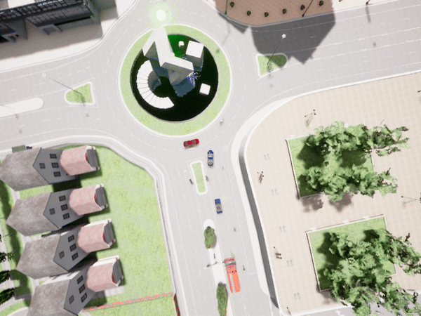
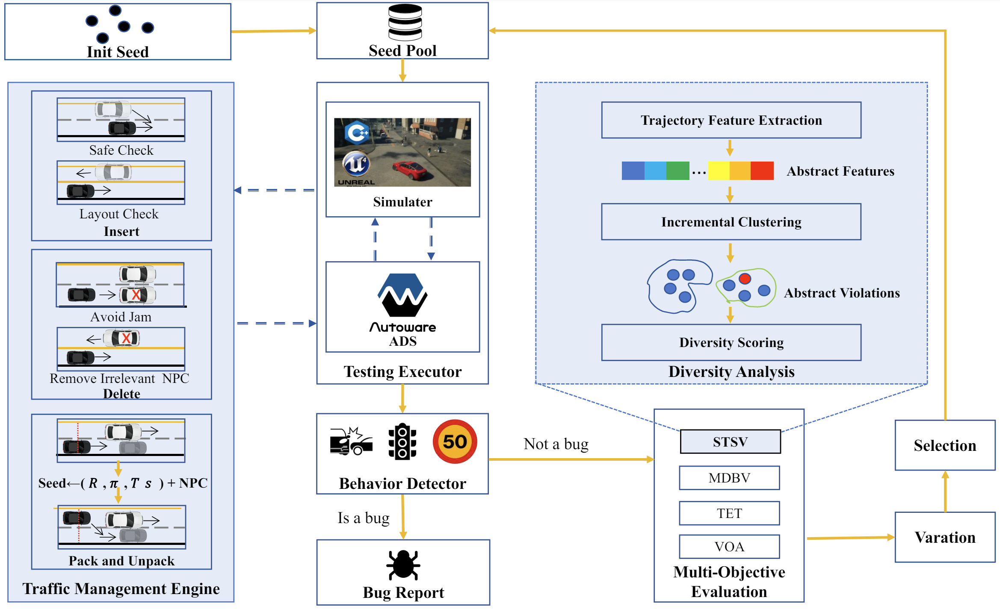
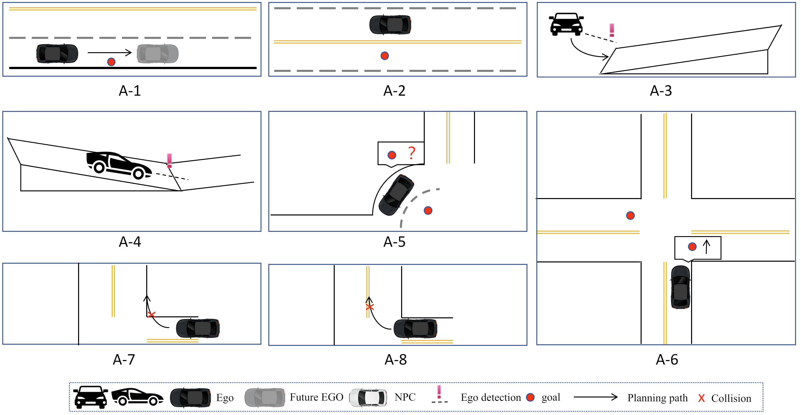
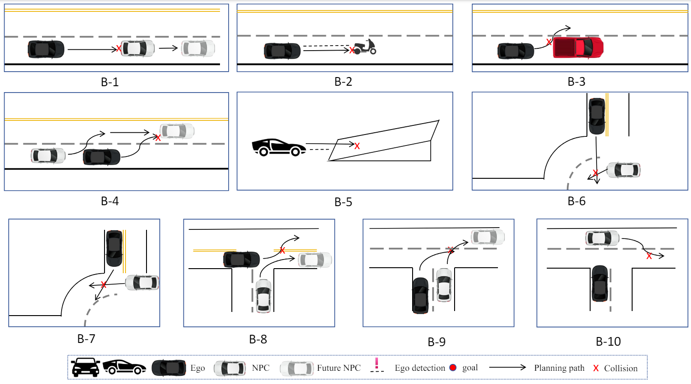
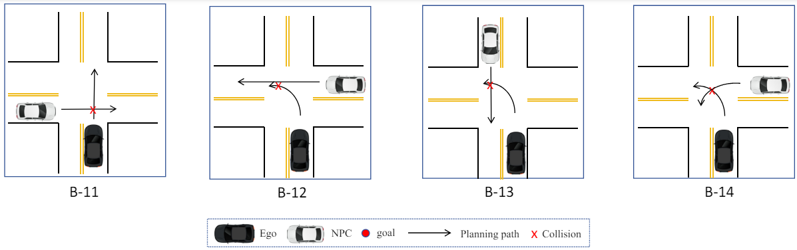
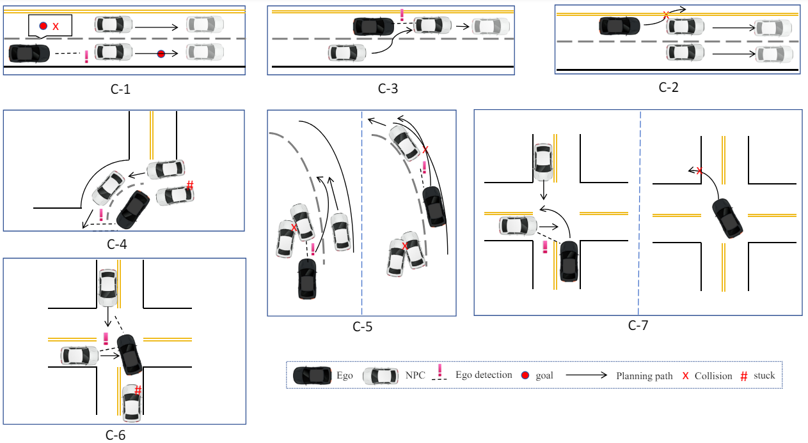

# TM-fuzzer

An innovative open-source framework designed to improve the safety and reliability of Autonomous Vehicles (AVs) through enhanced scenario-based testing. 

Developed using insights from cutting-edge research, TM-fuzzer leverages unique techniques for traffic management and scenario diversity to identify critical scenarios that expose potential vulnerabilities in ADS.


<p align="center">
  
  
  
</p>

## Key Features

**NPC Traffic Management:** TM-fuzzer introduces a novel method for Non-Player Character (NPC) traffic management, which includes dynamic insertion, deletion, and management of NPCs. This approach increases interactions between NPCs and the ego vehicle, enhancing the complexity of test scenarios.

**Diversity Analysis through Clustering:** We employ clustering analysis to ensure the diversity of test scenarios. By analyzing the features from vehicle trajectories in previous accidents, TM-fuzzer optimizes scenario selection to expose new and unique ADS defects.

**Efficient Scenario Searching:** The framework dynamically generates NPCs and utilizes advanced clustering techniques to create a diverse range of realistic traffic situations, significantly improving the detection rate of ADS vulnerabilities.



## Testing environment

The following environment was used to perform the testing for this
project:

* Hardware
  * CPU: Intel(R) Xeon(R) Gold 5120 CPU @ 2.20GHz
  * GPU: Tesla V100-32GB (x2)
  * RAM: 128 GB
* OS & SW
  * Ubuntu 18.04.6 LTS with Linux 5.4.0-139-generic
    * This is strictly required by Autoware, one of our test targets
  * Python 3.6.9

In addition, CARLA (the simulator we use) requires the following:
(based on `https://carla.readthedocs.io/en/0.9.13/build_linux/`)
  * Ubuntu 18.04
  * 30GB disk space
  * An adequate GPU
  * Two TCP ports and good internet connection

## Installation

> Before installing TM-fuzzer, make sure docker and nvidia-docker2 has been installed properly in your machine.

### 1. Install CARLA 0.9.13

#### Installing 
Please refer to the official CARLA installation guide:
[Installing Carla from docker](https://carla.readthedocs.io/en/0.9.13/download/)

Or just pull by:
```
docker pull carlasim/carla:0.9.13
```

#### Quick-running Carla
Carla can be run using a wrapper script `run_carla.sh`.
If you have multiple GPUs installed, it is recommended that
you "pin" Carla simulator to one of the GPUs (other than #0).
You can do that by opening `run_carla.sh` and modifying the following:
```
-e NVIDIA_VISIBLE_DEVICES={DESIRED_GPU_ID} --gpus 'device={DESIRED_GPU_ID}
```

To run carla simulator, execute the script:
```sh
$ ./run_carla.sh
```
It will run carla simulator container, and name it carla-${USER} .

To stop the container, do:
```sh
$ docker rm -f carla-${USER}
```

### 2. Install carla-autoware docker

Please refer to the official [carla-autoware](https://github.com/carla-simulator/carla-autoware) installation guide, and in order to fit our own mechine (which works without external network access capabilities), and make it work in TM-fuzzer, we make some modifications in [our own forks](https://github.com/cfs4819/carla-autoware/tree/TMfuzz).

Our Modifications:
- Add *proxy server*, *nameserver*, *ros source* in the dockerfile, which can be deleted if you don't need them.
- Add our own `entrypoint.sh` so we can run simulation directly after the container is started.
- Add a shell script `pub_initialpose.py` so we can easily change the initial pose of the ego vehicle.
- Add a shell script `reload_autoware.sh` so we can easily reload the simulation without restarting the container.
- Add some camera in `objects.json` for recording the simulation.
- Upgraded the carla version to 0.9.13, file changed in `update_sim_code.patch`, `carla-autoware-agent/launch/carla_autoware_agent.launch`

So, first clone the carla-autoware repo modified by us:

```sh
git clone https://github.com/cfs4819/carla-autoware/tree/TMfuzz
```
then make some modifications in `Dockerfile` depends on your mechine.

Then, download the additional files

```sh
cd carla-autoware/
git clone https://bitbucket.org/carla-simulator/autoware-contents.git
```

Last, build the carla-autoware repo

```sh
./build.sh
```

### 3.Installing ROS-melodic

ROS is required on the host in order for TM-Fuzzer to communicate with
the Autoware container.

```sh
sudo sh -c 'echo "deb http://packages.ros.org/ros/ubuntu $(lsb_release -sc) main" > /etc/apt/sources.list.d/ros-latest.list'
sudo apt install curl
curl -s https://raw.githubusercontent.com/ros/rosdistro/master/ros.asc | sudo apt-key add -
sudo apt update
sudo apt install ros-melodic-desktop-full
source /opt/ros/melodic/setup.bash
```
### 4.Installing other dependent environments

```sh
pip install -r requirements.txt
```

## Usage

### 1. Prepare environment

```sh
mkdir -p /tmp/fuzzerdata
sudo chmod 777 /tmp/fuzzerdata
mkdir -p bagfiles
sudo chmod 777 $HOME/.Xauthority
source /opt/ros/melodic/setup.bash
```

### 2. Run fuzzing

* Testing Autoware
```sh
cd ./TM-fuzzer/script
./test.sh autoware 0.4 3 3600
```
* Testing Behavior Agent

```sh
cd ./TM-fuzzer/script
./test.sh behavior 0.4 3 3600
```

* Outputs (bugs, mutated test inputs, metadata, ...) will be stored in `data`.
* You can change the test details by modifying the parameters after `./test.sh`. 
The second parameter represents the vehicle density in the traffic flow,
  the third parameter represents the test map number (from 1 to 5),
  and the fourth parameter represents the total test time (seconds).
* Check `./TM-fuzzer/fuzzer.py --help` for further instructions.

## Vioaltion details

| Category | ID   | Summary of Violation                                                                    |
|----------|------|-----------------------------------------------------------------                        |
| A        | A-1  | Inaccurate stop at destination causing overshoot.                                       |
| A        | A-2  | Misinterpretation of destination across lanes.                                          |
| A        | A-3  | Erroneous permanent halt on slopes.                                                     |
| A        | A-4  | Misjudgment of road surface as obstacle on declines.                                    |
| A        | A-5  | Difficulty in exiting roundabouts correctly.                                            |
| A        | A-6  | Misjudgment at intersections affecting route continuity.                                |
| A        | A-7  | Excessive turning angles causing lane boundary crossings.                               |
| A        | A-8  | Insufficient turning radius leading to collisions with walls.                           |
| B        | B-1  | Delayed braking leading to rear-end collisions.                                         |
| B        | B-2  | Non-detection of non-motorized entities leading to collisions.                          |
| B        | B-3  | Collisions during lane changes with large vehicles.                                     |
| B        | B-4  | Reckless lane changes causing collisions.                                               |
| B        | B-5  | Collisions on slopes due to failed vehicle detection ahead.                             |
| B        | B-6  | Entry collisions in roundabouts.                                                        |
| B        | B-7  | Inappropriate lane changes in roundabouts leading to collisions.                        |
| B        | B-8  | Lane marking violations at T-intersections to avoid merging vehicles.                   |
| B        | B-9  | Collisions during merging at T-intersections with original lane vehicles.               |
| B        | B-10 | Collisions during merging at T-intersections with new lane vehicles.                    |
| B        | B-11 | Collisions with straight-moving vehicles at crossroads.                                 |
| B        | B-12 | Collisions during unsignaled left turns with oncoming vehicles.                         |
| B        | B-13 | Collisions across opposite lanes during unsignaled left turns.                          |
| B        | B-14 | Collisions with vehicles making diagonal left turns at intersections.                   |
| C        | C-1  | Incorrect route planning in congested traffic leading to unreachable destination.       |
| C        | C-2  | Entering opposing lane during traffic congestion.                                       |
| C        | C-3  | Loss of vehicle control due to failure to issue next command in complex conditions.     |
| C        | C-4  | Overly cautious driving preventing roundabout exit in complex conditions.               |
| C        | C-5  | Incorrect overtaking judgments leading to collisions with curbs.                        |
| C        | C-6  | Overly conservative driving at intersections preventing unsignaled left turns.          |
| C        | C-7  | Incorrect maneuvers during unsignaled left turns leading to collisions with curbs.      |














## Citation
If you use TM-fuzzer in your research, please cite our paper:

> Shenghao Lin, Fansong Chen, Laile Xi et al. TM-fuzzer: fuzzing autonomous driving systems through traffic management, 03 April 2024, PREPRINT (Version 1) available at Research Square [https://doi.org/10.21203/rs.3.rs-4185312/v1]

BibTeX:
```
@article{lin2024tm,
  title={TM-fuzzer: fuzzing autonomous driving systems through traffic management},
  author={Lin, Shenghao and Chen, Fansong and Xi, Laile and Wang, Gaosheng and Xi, Rongrong and Sun, Yuyan and Zhu, Hongsong},
  year={2024}
}
```
## License

This project is licensed under the MIT License—see the [LICENSE](LICENSE) file for details.

